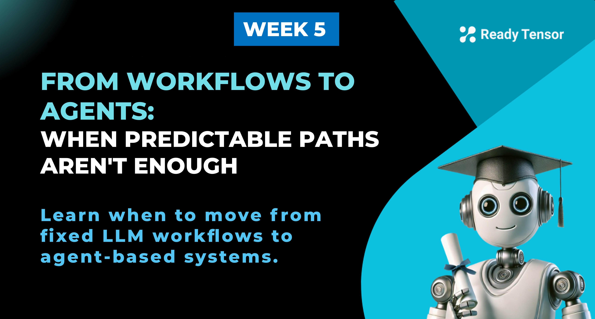
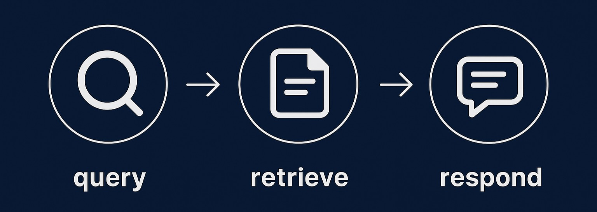
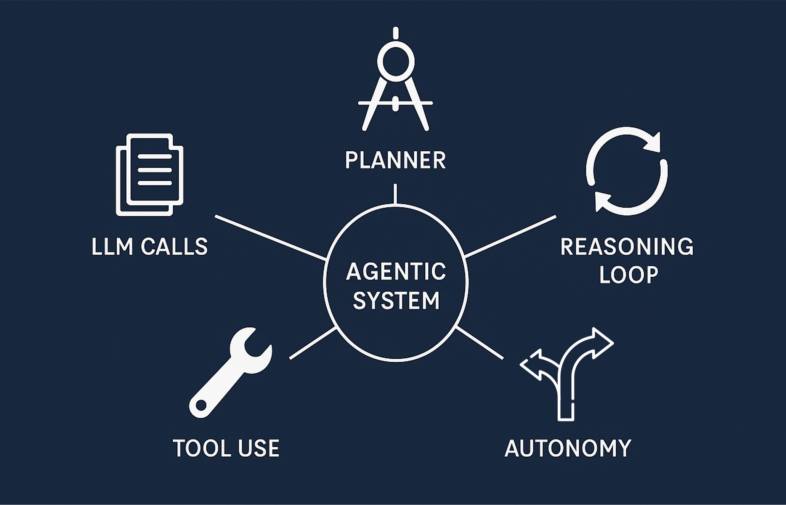
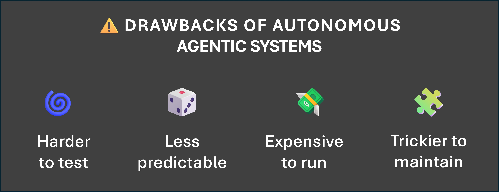

--DIVIDER--

---

[⬅️ Previous - Week 5 Preview](https://app.readytensor.ai/publications/jcd9IGoIp9sl)
[➡️ Next - Intro to LangGraph](https://app.readytensor.ai/publications/J98Nkhh5Z8CW)

---

--DIVIDER--

# TL;DR

Learn when to move beyond predictable LLM workflows toward more dynamic agent-based systems. This lesson breaks down the spectrum between static workflows and adaptive agents — and shows how to choose the right level of flexibility for your use case.

---

--DIVIDER--

# What We've Built So Far 🛠️

In Module 1, you built impressive assistants using:

- Making basic LLM calls
- Multi-turn conversations
- Memory (including persisted memory)
- Vector databases
- Retrieval-augmented generation (RAG)

What's even more remarkable: **we accomplished all of this without any tools, and without any agents**. Just LLMs, retrieval, and smart prompting.

These systems were powerful — and also predictable. Your RAG assistant followed a consistent path:

That predictability is a feature. It makes your system easy to debug, easy to monitor, and cost-effective to run.

But such predictability comes at a cost: the system only works when the path is known in advance.

---

--DIVIDER--

# Limitations of Pre-Defined LLM Workflows

You’ve built a solid RAG assistant. It answers user questions about your publications — efficiently, predictably. You’re feeling good.

--DIVIDER--

Then your manager walks in and says:

> "Users are starting to ask more complex questions. Like — _Is the technique in this publication actually state-of-the-art?_
> Can we cross-reference with arXiv or other sources?"

You say "No problem." You add a **router** that detects questions needing external info. If needed, it hits an API to fetch fresh data. Your workflow just got a little more… conditional.

---

--DIVIDER--

A few days later:

> “Now they want stats.
> _What percentage of our RAG implementations use Chroma DB?_”

Hmm... 🤔 This needs you to scan all relevant publications, extract metadata, and compute an aggregate.

So you add another _if-then_ branch and build **a fan-out loop** — scan documents, extract info, tally the results.

It’s not elegant, but it works. The system now handles more complex aggregation queries.

---

--DIVIDER--

Next day, your manager makes another request:

> “Users are starting to ask for comparisons. Like — _How are transformer models being used across our computer vision projects?_
> Can we group them and highlight what’s different?”

Okay. You sigh.
This is turning into a **nested workflow jungle** 😓 — branching logic, map-reduce flows, specialized handlers everywhere.

It still works.
But every new request adds more logic.
Your once-elegant system is starting to resemble spaghetti.

---

--DIVIDER--

Then comes the final blow:

> “Users are asking open-ended questions. Like: _What are the most important insights across these 500 new publications?_ > _Extract trends — by industry, by technique, by framework. Summarize what people are doing well. Suggest areas for improvement._
> Can we support questions like these?”

---

--DIVIDER--

You stare at your branching workflow, your routers and mappers, your conditional flags ...
And you realize:

> > _**❗This is no longer a workflow problem — because you can’t even predict the paths anymore.**_

You don’t need another `if-else`.

You need a system that can **adapt, plan, delegate, analyze, critique, and synthesize** — all in response to open-ended goals.

You need a system that can **choose its own next steps**. A system that makes decisions, uses tools, explores unknowns, and coordinates across tasks .

That’s the shift — from a predictable, static workflow… to a dynamic, agent-based system.

---

--DIVIDER--

# Dynamic, Agent-Based Systems 🧠

At this point, you might be wondering:
We’ve mentioned agents and agentic or agent-based systems… but what exactly makes something an _agent_?

Let’s start with a simple definition from Hugging Face:

> **“AI agents are systems where LLM reasoning determines the next steps in a dynamic workflow.”**

In other words, instead of just following a fixed script, the system **decides what to do next based on what it just discovered**.

--DIVIDER--

## So What Makes a System Agentic? 🤖

--DIVIDER--

--DIVIDER--

Agentic systems typically include:

- ✅ **Multiple LLM calls**, not just one-shot answers
- 🔧 **Tool use** to search, calculate, write, fetch, or manipulate
- 🧠 **A reasoning loop** that can reflect and revise
- 🧭 **A planner or controller** to coordinate what happens when
- 🎯 **Autonomy** — it decides how to achieve the goal

More broadly, these systems don’t just respond — they can plan and take flexible sequences of actions to achieve a goal, adapting their course based on the needs of the task.

--DIVIDER--

## Let’s Connect Back to Your RAG Assistant 📚

Remember your assistant from Module 1? It followed a clear, fixed path:
**query → retrieve → respond**

Now imagine an agentic version of that assistant:

1.  It sees your question and says, _“Hmm, this might need external info.”_
2.  It decides to search arXiv — or maybe checks an internal knowledge base first.
3.  It pulls multiple sources, weighs them, and even evaluates which is more up-to-date.
4.  If unsure, it clarifies the user’s intent before answering.

At every step, the **LLM decides what to do next**.

That’s the shift from a workflow… to a truly agentic system.

---

--DIVIDER--

# It’s a Spectrum, Not a Switch ⚖️

It’s tempting to think of workflows and agents as two separate categories — one static and rule-based, the other dynamic and autonomous. But in practice, that distinction isn’t so clean.

Most real-world systems fall **somewhere in between**.

You might have a mostly predictable flow with just one agentic step:
→ _“Check if user intent is unclear. If so, ask a clarifying question.”_

Or you might go further:
→ _“Decide whether to retrieve from memory, search externally, or ask the user to rephrase — based on what we’ve seen so far.”_

**Agentic behavior exists on a spectrum.**
The more flexibility you introduce, the more autonomy the system has — and the more powerful it becomes.

But there's a catch.

---

--DIVIDER--

# Agentic Flexibility Comes at a Cost ⚠️

It’s easy to fall in love with the idea of a fully autonomous, open-ended agent that can figure out anything, route any request, and call any tool.

--DIVIDER--

--DIVIDER--

But highly flexible systems come with hidden costs.

They’re harder to test, less predictable in their behavior, more expensive to run, and notoriously tricky to debug when things go wrong. What feels like intelligent autonomy in a demo can quickly become unmanageable in production — especially when workflows loop, branch, or trigger unexpected tool usage.

**Just because you _can_ make something dynamic doesn't mean you _should_.**

Let’s go back to that last request from your manager:

> “Users are asking open-ended questions. Like: _What are the most important insights across these 500 new publications?_ > _Extract trends — by industry, by technique, by framework. Summarize what people are doing well. Suggest areas for improvement._
> Can we support questions like these?”

Sounds like a dream use case, right?
But before you rush to build a massively dynamic multi-agent system with autonomous planning and open-ended synthesis… pause.

Ask yourself:

> **Is this even feasible?
> Can we support this _reliably_, not just _theoretically_?**

Maybe it's enough to extract key tags. Maybe “I don’t know” is the right answer for certain complex queries — not a flaw.

Remember, agentic design isn’t about chasing autonomy.  
 It’s about building systems that adapt **when needed**, while staying grounded in reliability and control.

Start with the simplest version that meets your needs.  
 Add flexibility only when it solves a real problem — not just because it sounds impressive.

---

--DIVIDER--

## Recap: What You Learned 🧩

In this lesson, you:

- Explored the limits of static LLM workflows — even sophisticated ones like RAG.
- Saw how user demands can push you toward more adaptive, agent-like behavior.
- Learned what defines an agentic system — and why most real systems live somewhere on the spectrum between static and autonomous.
- Learned to prioritize simplicity and reliability over raw autonomy.

Building agentic systems isn’t about complexity for its own sake — it’s about choosing when dynamic behavior adds value, and designing with that in mind.

---

--DIVIDER--

---

[⬅️ Previous - Week 5 Preview](https://app.readytensor.ai/publications/jcd9IGoIp9sl)
[➡️ Next - Intro to LangGraph](https://app.readytensor.ai/publications/J98Nkhh5Z8CW)

---
