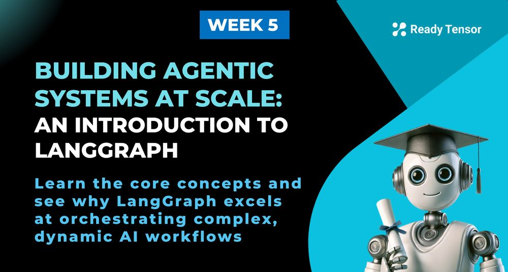
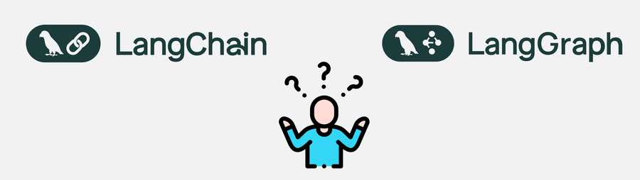
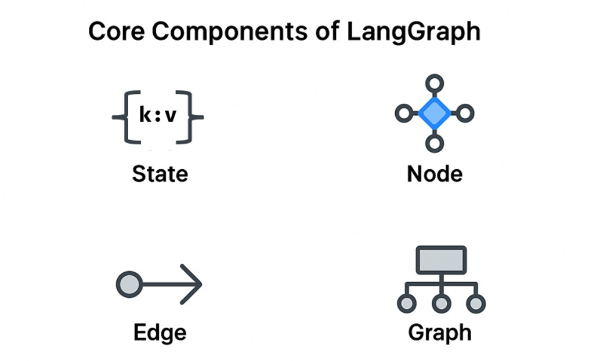

--DIVIDER--

---

[⬅️ Previous - From LLM Workflows to Agents](https://app.readytensor.ai/publications/Nu7EEaBmrP5C)
[➡️ Next - First LangGraph Project](https://app.readytensor.ai/publications/T8WbWCjwJ4Mm)

---

--DIVIDER--

# TL;DR

This lesson introduces LangGraph — a framework for building scalable, agentic systems by defining workflows as graphs. You’ll learn why LangGraph was created, how it differs from LangChain, and what makes it ideal for complex, multi-agent flows. We’ll cover the core concepts of nodes, edges, state, and super-steps — and explain how LangGraph lets you balance flexibility with determinism.

--DIVIDER--

:::info{title="Info"}
This lesson includes a short video quiz at the end to help you **reflect on and reinforce your understanding of LangGraph**.

📌 Since this is your **first introduction to LangGraph**, we recommend reading the full lesson first.
Then, test yourself with the quiz — it’s a fun way to **check your grasp of the key ideas** before moving on.
:::

--DIVIDER--

# 🚧 When Static Workflows Start to Break Down

In the last lesson, we saw what happens when static workflows just can’t keep up.

You started with a beautiful, minimal RAG assistant — a few clean function calls, maybe a memory module, some smart prompting. Life was good.

Then came the routing logic. Then conditionals. Then tool calls, loops, branching workflows, nested flows, fallback handlers, external lookups, aggregators, user clarifiers…

Soon, what began as a single chain turned into a full-blown jungle gym of agents, routes, retries, and specialized logic paths. And it was still growing.

You weren’t building a simple LLM app anymore.

You were managing an **evolving system** — something with state, externalities, and adaptive behavior.

But your code wasn’t designed for that.

--DIVIDER--

# 🧭 Enter LangGraph --DIVIDER--


--DIVIDER--

What if there were a way to build agentic systems that **scale in complexity — without collapsing under their own weight**?

What if your LLM flows could stay **structured**, **inspectable**, and **robust** — even as they became more dynamic, tool-using, memory-persisting, goal-seeking agents?

That’s what LangGraph was built for.

LangGraph is an open-source framework designed specifically for **graph-based orchestration of agentic workflows** — think of it as a way to give your agents a map, some structure, and a few ground rules... so they don’t wander off into chaos.

In this lesson, we’ll learn what LangGraph is, why it exists, and how it fits into the LangChain ecosystem. We’ll explore its core concepts — like **graphs**, **nodes**, **edges**, and **state** — and begin shifting your mental model from linear workflows to flexible flows that empower adaptive, scalable, agentic behavior.

You won’t build anything yet (that’s coming in 2b). But by the end of this lesson, you’ll know exactly why LangGraph matters — and why it might become your favorite new tool for managing agentic systems with confidence.

Let’s go.

---

--DIVIDER--

:::info{title="Info"}

 <h2>⚠️ LangGraph Isn’t the Only Path </h2>
 
 Before we go deeper, let’s pause for an honest moment.
 
 LangGraph is powerful. It’s our tool of choice in this program because it offers a **sweet spot**: the right level of flexibility and abstraction, without making you write endless boilerplate orchestration code.
 
 But it’s not the only game in town — and it’s not always the best choice.
 
 If you're building an agentic system, you might also consider:
 
 - **[Autogen](https://microsoft.github.io/autogen/)** — Microsoft’s framework for building multi-agent conversations with advanced planning and memory-sharing.
 - **[CrewAI](https://docs.crewai.com/)** — a lightweight agent orchestration library that treats agents as mission-driven “crew members” with specific roles.
 - **[LlamaIndex](https://www.llamaindex.ai/)** — a data framework focused on retrieval, indexing, and orchestration of complex LLM flows, with built-in support for agents, tools, memory, and observability.
 - **Direct SDKs** — you can always work directly with the APIs from LLM providers like OpenAI, Anthropic, or Cohere. This gives you maximum control — but it also means writing (and maintaining) all the orchestration logic yourself. And there's a catch: **if you later switch providers, your code may need major updates.** While many APIs are starting to converge around OpenAI-style function calling, there are still meaningful differences. For instance, Anthropic continues to use its own input formats and tool protocols.
 
 Each of these paths comes with tradeoffs:
 
 - Some offer more flexibility, but require you to **write and maintain a lot more code**.
 - Others are simple to start with, but **don’t scale well** to complex flows or real-world needs.
 - And sometimes, good old-fashioned `if-then` statements are all you need.
 
 We’ve chosen **LangGraph** because it’s a great middle ground:
 
 - Enough control to model **real agentic behavior**
 - Enough structure to prevent your system from **spiraling into chaos**
 - And enough abstraction to avoid **repeating yourself endlessly**
 
 Just remember: there’s no one-size-fits-all framework in agentic AI development.
 
 LangGraph is a great choice — not the only choice. Use it when it helps. Reach for something else when it doesn’t.
 
 :::
 
 ---

--DIVIDER--

# 🔧 LangGraph in the LangChain Ecosystem

--DIVIDER--



--DIVIDER--

You might be wondering:  
 **Isn’t LangGraph just part of LangChain? What’s new here?**

Fair question — especially if you’ve used LangChain agents before.

LangGraph is built by the same team, and it works great with LangChain components like tools, memory, retrievers, and chains. But it’s a **separate framework** with a different purpose.

LangChain is about **building blocks** — prompts, chains, tools, memory.  
 LangGraph is about **flow control** — how those blocks connect, branch, retry, loop, and evolve over time.

Use the following as guide:

> If your workflow is a Directed Acyclic Graph (DAG), use LangChain.
> If it’s complex, cyclical, or iterative — you might want to reach for LangGraph.

You can use LangGraph with LangChain, without LangChain, or even without LLMs. It’s just Python — built for scaling agentic workflows with structure and safety.

They’re designed to work together — but they solve different problems.

LangChain is great for predictable flows.  
 LangGraph is built for **dynamic, multi-agent systems** that adapt and evolve.

---

--DIVIDER--

# 🧱 Core Components of LangGraph

LangGraph is built on four core building blocks: **state**, **nodes**, **edges**, and **graphs**.

--DIVIDER--



--DIVIDER--

Once you understand these, you can build anything from tool-using assistants to multi-agent systems with complex feedback loops. Let’s walk through them in the right order.

---

## 🧠 State

State refers to the current context of your workflow. It is represented as Pydantic object or a Typed Dict that carries all relevant information as your workflow runs. This might include:

- The original user input
- Intermediate outputs
- Flags or counters
- Anything your system needs to remember or reason about

Every function in your graph will receive the current state, do something useful, and return an updated version.

---

## 🔹 Nodes

**Nodes** are the functional building blocks of your system.

**Each node is just a function**. It receives the current state, performs a step of work (like calling an LLM, using a tool, or some other non-LLM logic), and returns a new version of the state.

You can keep nodes simple or pack them with logic — LangGraph doesn’t care. All that matters is: **state in → state out**.

It is important to emphasize - nodes can be any functions, not just LLM calls. You can use regular Python functions, external APIs, or any callable that fits your workflow.

---

## ➡️ Edges

**Edges** define the flow from one node to the next.

Sometimes that flow is fixed — “after this node, go to the next one.”

But often it’s **conditional**: you decide what happens next based on the current state (i.e. output from the previous node).

This makes your workflow dynamic. For example:

- Route to different tools based on detected intent
- Retry or clarify if the output isn't good enough
- Skip unnecessary steps based on progress so far

Instead of hardcoding the logic flow, you let the system adapt its own path — based on what it just learned.

---

## 🔁 Graph

The **graph** is the structure that ties everything together.

You define:

- The available nodes
- How they’re connected with edges
- Where the flow begins and ends

LangGraph uses this structure to execute your workflow from start to finish — moving through nodes, routing based on conditions, and evolving the state along the way.

The graph is your system’s brainstem — not doing the thinking itself, but connecting all the parts so the thinking can happen.

---

--DIVIDER--

# ⚙️ Building and Running a LangGraph

Now that you’ve seen the core components — state, nodes, edges, and graphs — here’s the good news:

> You’ll follow the same five steps every time you build with LangGraph.

This pattern holds whether you’re building a two-node assistant or a multi-agent workflow with loops and retries.

## 🛠️ The 5-Step LangGraph Workflow

 <h3>1. Define the state</h3>
 
 Decide what information your system needs to carry throughout the workflow. Use a Pydantic model (or typed dictionary/dataclass) to define the structure — like current category, user choice, or a list of past jokes.
 
 <h3>2. Write your node functions</h3>
 
 Each node is just a Python function. It receives the current state and returns an updated version — either fully or partially. Nodes can do anything: call an API, update a value, print something, or fetch a joke (like we’ll do here).
 
 <h3>3. Create a graph builder</h3>
 
 Instantiate a `StateGraph`, specifying the state type. Think of this as preparing a blank map before plotting your logic.
 
 <h3>4. Add nodes and edges</h3>
 
 Register your node functions and define how they connect. Use fixed edges or conditional routing logic based on values in the state.
 
 <h3>5. Compile and run the graph</h3>
 
 Once everything is wired up, compile the graph. This gives you an executable workflow that you can run with:
 
 ```python
 graph.invoke(initial_state)
 ```
 ---

--DIVIDER--

# How LangGraph Executes: Reducers, Super-Steps & State Persistence

--DIVIDER--

## 🔄 Reducer Functions: How State Updates Work

When multiple nodes try to update the same piece of state — either in parallel or sequentially — how does LangGraph decide what the final value should be?

LangGraph solves this with **reducer functions** — optional functions you attach to fields in your state class. They define how to merge the current value with a new update:

```python
(current_value, new_value) -> merged_value
```

This lets you handle concurrent updates safely and predictably.

 <h3> 🧩 Common Reducer Patterns (with Class Examples) </h3>
 
 <h4> ✅ Default (Overwrite)</h4>
 
 This is the default behavior. New values overwrite the old ones — no reducer needed.
 
 ```python
 from pydantic import BaseModel
 
 class State(BaseModel):
     messages: str  # Default: overwrite
 ```
 
 
 <h4>➕Append to Messages (LLM Chat Apps)</h4>
 
 LangGraph provides a special reducer for appending chat messages.
 
 ```python
 from pydantic import BaseModel
 from typing import Annotated
 from langgraph.graph.message import add_messages
 
 class State(BaseModel):
     messages: Annotated[list, add_messages]
 ```
 
 <h4>➕Append to Generic Lists</h4>
 
 For accumulating lists of items — e.g. documents, tool responses.
 
 ```python
 from pydantic import BaseModel
 from typing import Annotated
 from operator import add
 
 class State(BaseModel):
     results: Annotated[list, add]
 ```
 
 <h4>🔢Sum or Count</h4>
 
 For tracking scores, token usage, or retry attempts:
 
 ```python
 from pydantic import BaseModel
 from typing import Annotated
 from operator import add
 
 class State(BaseModel):
     total_cost: Annotated[int, add]
 ```
 
 <h4>🧠Custom Merge Logic</h4>
 
 Use a custom reducer for more complex structures like merging dicts:
 
 ```python
 from pydantic import BaseModel
 from typing import Annotated
 
 def merge_user_data(current: dict, update: dict) -> dict:
     merged = current.copy()
     merged.update(update)
     return merged
 
 class State(BaseModel):
     user_profile: Annotated[dict, merge_user_data]
 ```
 
 <h3>Why This Matters</h3>
 
 Without reducers, you’d need to manually handle state conflicts — especially when running nodes in parallel.
 
 Reducers let you:
 
 * **Merge state cleanly** when multiple nodes contribute
 * **Avoid accidental overwrites** or race conditions
 * **Build flows that evolve naturally** over time
 
 Think of reducers as your **rules for safe collaboration** — whether among nodes, agents, or tools.
 
 > ⚠️ Don’t worry if this feels abstract — we’ll see reducers in action in the next lesson.

--DIVIDER--

## ▶️ Super-Steps: How a Graph Actually Runs

So what happens when you run a LangGraph?

Every time you call `graph.invoke()` (or `graph.run()`), LangGraph performs what’s called a **super-step**.

A super-step is a single pass through the graph — starting at the current node(s), executing any eligible logic, and updating the state accordingly.

Depending on your routing logic, a super-step may:

- Run just one node and move forward
- Trigger multiple nodes to run in parallel
- Loop back to earlier nodes
- Or terminate the flow, if no more edges apply

Each super-step:

- Receives a snapshot of the current state
- Executes one or more nodes
- Produces a new state
- Decides what node(s) to visit next

LangGraph continues running super-steps **until the flow completes** — i.e., no active nodes remain.

 <h3>🧍 Human-in-the-Loop Pauses </h3> 
 
 LangGraph supports **human-in-the-loop workflows** — for example, asking for manual review or approval.
 
 When your graph pauses to wait for input (e.g., via an "await user response" node), execution **stops at that point**. You can store the state, send a notification, and pick things up later.
 
 When you resume the graph, you're starting a **new super-step** — with the last known state as your input.
 
 <h3> 💾 Persisting State Between Super-Steps </h3>
  
 ⚠️**Important:** LangGraph doesn’t persist state for you by default.  
 If you're building multi-session flows, **you must save the state** between super-steps (e.g., to a database or file).
 
 <h3> Why this matters </h3> 
 This super-step model makes LangGraph:
 
 - **Interruptible** — perfect for long-running or human-in-the-loop flows
 - **Inspectable** — every state change is traceable
 - **Deterministic** — same inputs yield the same results (unless you add randomness)
 
 You don’t have to manage any of this manually. Just define your nodes, edges, and state — and LangGraph handles the orchestration for you.
 
---

--DIVIDER--

# 🧠 Core Strengths of LangGraph

Once you start building with LangGraph, a few things stand out. These aren’t just conveniences — they solve real problems that come up fast in agentic systems.

## 1. ✅ Memory Management Made Easy

In many agent frameworks, memory is bolted on — you have to manually track what was said, what tools were used, or what plans were made.

In LangGraph, your **state is your memory** — and every node has access to it.  
 No special wrapper required. No callback hell.

Want to persist memory across sessions? Just save the state object. Done.

## 2. 🕰️ Checkpointing and Time Travel

LangGraph automatically tracks every state update — which means you can:

- Resume flows from a saved point
- Rewind and inspect earlier decisions
- Debug what happened and why

This is especially useful for:

- Long-running or asynchronous tasks
- Human-in-the-loop approvals
- Recovery from failed tool calls or invalid inputs

You don’t have to build your own session store or audit log. LangGraph handles it out of the box.

## 3. 🔀 Safe Parallel Execution

LangGraph lets you define **multiple outgoing edges** from a node and run them in parallel. That’s hard to do safely in most frameworks.

LangGraph handles concurrent state updates safely through **reducer** functions.
When parallel nodes both try to update the same part of state, the reducer function determines how to merge their contributions — whether that's appending to a list, taking the maximum value, or applying custom logic.
This means you can have multiple agents working on different aspects of a problem simultaneously, without worrying about race conditions or lost updates.

## 4. 🧩 Configurables and Personalization

LangGraph supports **configurables** — parameters that can change per user, thread, or session.

You can define different flows, memory settings, or behaviors for different users — all using the same underlying graph. This makes it easier to build personalized assistants or per-user logic at scale.

---

--DIVIDER--

# 🎥 Reflect and Test Your Understanding

Before you move on, take a moment to **step back and think**.

This short video quiz won’t give you the answers — but it will challenge your assumptions, stretch your thinking, and help you spot the **core ideas** behind LangGraph and agentic AI design.

It’s not about memorization. It’s about **intuition**.

👉 **Watch the video** and see how many questions you can reason through:

:::youtube[Title]{#Px1Yj4rYN0A}

---

--DIVIDER--

# 🧭 What’s Next: From Concepts to Code

Now that you know how LangGraph works — and why it matters — it’s time to build.

In **Lesson 2b**, you’ll define your own state, add nodes, connect them with edges, and run your first real agentic flow.

Let’s go.

--DIVIDER--

---

[⬅️ Previous - From LLM Workflows to Agents](https://app.readytensor.ai/publications/Nu7EEaBmrP5C)
[➡️ Next - First LangGraph Project](https://app.readytensor.ai/publications/T8WbWCjwJ4Mm)

---
