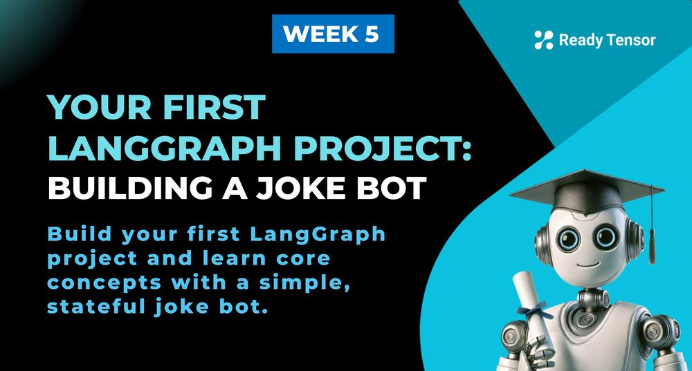
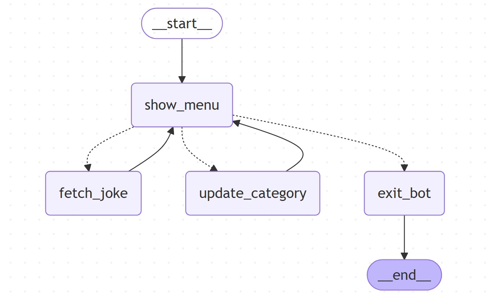

--DIVIDER--

---

[⬅️ Previous - Intro to LangGraph](https://app.readytensor.ai/publications/J98Nkhh5Z8CW)
[➡️ Next - LangGraph Writer-Critic Loop](https://app.readytensor.ai/publications/zvrcImvr8AF4)

---

--DIVIDER--

# TL;DR

In this lesson, you’ll build your first LangGraph project — a simple joke bot — to learn how to define state, create nodes, add conditional edges, and run a stateful workflow. No LLMs yet — just clean, inspectable graph logic to help you master the fundamentals.

--DIVIDER--

# Getting Started with LangGraph

Before we dive into tools, agents, and LLMs, let’s master the **fundamentals of LangGraph** — how to build and run a graph-based workflow.

To keep things simple (and fun), we’ll build a **joke bot** that tells you jokes from different categories. There’s no LLM here — and that’s intentional. This example is **not** about building a useful chatbot. It’s about helping you:

- Understand how LangGraph works,
- Practice structuring stateful, node-driven flows,
- And gain confidence with conditional edges, routing, and state updates.

LangGraph is typically used with agents and language models. But here, we’re skipping all that to **focus on the core mechanics** — so when we add complexity later, you’ll know exactly what’s happening under the hood.

You’ll learn how to:

- Define state and reducer functions
- Create reusable, logic-driven nodes
- Build a menu loop with conditional routing
- Keep track of evolving information across steps

By the end, you’ll have a running LangGraph app — and a clear mental model for how LangGraph systems work.

--DIVIDER--

# Watch the Demo: Joke Bot in Action 🎬

Before you dive into the project, take a quick look at the joke bot you’re about to build. This video demo walks through the full user experience — from choosing jokes to switching categories — so you can see how LangGraph drives the logic behind the scenes.

It’s short, fun, and gives you a clear picture of the project outcome.

:::youtube[Title]{#i8QpsnZgWIo}

--DIVIDER--

# What You’ll Build: An Interactive Joke-Telling Bot 🤖

Your project is a simple and playful joke-telling bot, built with LangGraph. We will be using the `pyjokes` library to fetch jokes - there are no LLM calls involved in this example.

Here’s how it works:

- You interact with a simple menu to either hear a new joke, switch joke categories, or exit the bot.
- Jokes come from a built-in joke library, and you can keep going as long as you like.
- Behind the scenes, LangGraph manages the logic, state transitions, and routing — all in a structured, inspectable graph.

The bot keeps track of two key things:

- **Which category** of jokes you’ve selected (e.g., neutral, chuck, or all)
- **Which jokes** you’ve already heard (so you can see your running list)

You’ll build reusable functions as graph nodes, route dynamically based on your choices, and see how LangGraph evolves state across steps. By the end, you’ll understand how a graph-based workflow actually runs — not just in theory, but in code.

And yes, it might make you laugh too 😄

Let’s get started.

---

--DIVIDER--

# The Workflow: One Graph, Four Nodes

Before we write any code, let’s take a look at the **structure of the graph** you’ll be building.

Here’s the Mermaid diagram that shows how the nodes connect:

--DIVIDER--



--DIVIDER--

This flow might look simple — and that’s the point. It’s meant to teach you the LangGraph mechanics with just enough logic to be interesting.

Let’s walk through the key parts:

**🟪 `show_menu`**

This is the **main control node**. Every time it runs, it shows the user three options:

- Hear another joke
- Change the joke category
- Quit the app

Based on the user’s input, the graph routes to one of the next nodes.

**🟩 `fetch_joke`**

This node fetches a joke from the selected category and displays it. After showing the joke, it routes back to `show_menu` so the user can make another choice.

**🟦 `update_category`**

This lets the user select a new category of jokes (like “chuck” or “neutral”). After the update, it also routes back to the menu.

**⛔ `exit_bot`**

When the user chooses to quit, this node says goodbye and ends the graph by routing to the special `__end__` node.

---

The entire system loops until the user explicitly chooses to quit.
This setup gives us a great little sandbox to practice:

- Looping behavior
- Conditional routing
- Dynamic state updates

Now that you’ve seen the structure, let’s start building it step by step.

---

--DIVIDER--

## Building the Bot in 5 Steps🛠️

In the last lesson, you learned the five steps to building any LangGraph system:

1.  **Define the state**
2.  **Write node functions**
3.  **Create graph builder**
4.  **Add nodes and edges**
5.  **Compile and run the graph**

We’ll follow the same structure here — but this time, we’re doing it hands-on.

---

--DIVIDER--

### 1. Define the State

We start by declaring what the bot should remember — the current joke category, what the user just selected, and a list of jokes already told. We also add a `quit` flag for graceful exit.

```python
class Joke(BaseModel):
    text: str
    category: str

class JokeState(BaseModel):
    jokes: Annotated[List[Joke], add] = []
    jokes_choice: Literal["n", "c", "q"] = "n" # next joke, change category, or quit
    category: str = "neutral"
    language: str = "en"
    quit: bool = False
```

We use `Annotated` with `add` to automatically append new jokes to the list.

Note that the reducer for `jokes` will append new jokes to the existing list, allowing us to keep track of what’s been told so far. For the other fields, we are using default reducer which simply overwrites the current value. This will be handled by LangGraph automatically.

---

--DIVIDER--

### 2. Write Your Node Functions

Each node is just a function that takes in the state and returns updates. We have four simple nodes:

--DIVIDER--

Here's the `show_menu` function that displays the menu and gets user input:

````python
def show_menu(state: JokeState) -> dict:
    user_input = input("[n] Next  [c] Category  [q] Quit\n> ").strip().lower()
    return {"jokes_choice": user_input}
```

--DIVIDER--

Now, let's implement `fetch_joke`, which pulls a joke from the `pyjokes` library and returns it:

```python
def fetch_joke(state: JokeState) -> dict:
    joke_text = get_joke(language=state.language, category=state.category)
    new_joke = Joke(text=joke_text, category=state.category)
    return {"jokes": [new_joke]}
````

--DIVIDER--

Next, we implement the `update_category` function, which allows the user to change the joke category:

````python
def update_category(state: JokeState) -> dict:
    categories = ["neutral", "chuck", "all"]
    selection = int(input("Select category [0=neutral, 1=chuck, 2=all]: ").strip())
    return {"category": categories[selection]}
```

--DIVIDER--

For our last node, we implement the `exit_bot` function, which will be called when the user chooses to quit:

```python
def exit_bot(state: JokeState) -> dict:
    return {"quit": True}
```

--DIVIDER--

We also define a **router function** to decide which node to go to next. This will serve as a conditional edge based on the user's choice:

```python
def route_choice(state: JokeState) -> str:
    if state.jokes_choice == "n":
        return "fetch_joke"
    elif state.jokes_choice == "c":
        return "update_category"
    elif state.jokes_choice == "q":
        return "exit_bot"
    return "exit_bot"
````

---

--DIVIDER--

:::info{title="Info"}

 <h2>🧩 A Note on State Management </h2>
 
 You might have noticed that none of our node functions mutate the state directly. Instead, each node simply returns a dictionary of field updates.
 
 This is by design.
 
 LangGraph handles state management for you — it takes the updates you return and produces a new state object behind the scenes. This means:
 
 - You don’t modify state in-place.
 - You just return `{field_name: new_value}`.
 - LangGraph takes care of creating the next state in the graph.
 
 This declarative approach keeps your logic clean, predictable, and easy to debug — especially as your graphs grow in complexity.
 
 So: **just return what changed**, and let LangGraph handle the rest.
 
 :::
 
---

--DIVIDER--

### Steps 3 & 4. Create the Graph and Add Nodes + Edges

We will use a builder function to create our graph. This is where we define the structure of our workflow and register all the nodes we created earlier.

```python
def build_joke_graph() -> CompiledStateGraph:
    workflow = StateGraph(JokeState)

    workflow.add_node("show_menu", show_menu)
    workflow.add_node("fetch_joke", fetch_joke)
    workflow.add_node("update_category", update_category)
    workflow.add_node("exit_bot", exit_bot)

    workflow.set_entry_point("show_menu")

    workflow.add_conditional_edges(
        "show_menu",
        route_choice,
        {
            "fetch_joke": "fetch_joke",
            "update_category": "update_category",
            "exit_bot": "exit_bot",
        }
    )

    workflow.add_edge("fetch_joke", "show_menu")
    workflow.add_edge("update_category", "show_menu")
    workflow.add_edge("exit_bot", END)

    return workflow.compile()
```

This function instantiates the `StateGraph`, registers our nodes, sets the entry point, and defines the routing logic. We are also compiling the graph at this point, which prepares it for execution.

---

--DIVIDER--

### 5. Run the Graph

Once everything is wired up, we can have the main function to run the graph. This is where we invoke the graph with an initial state and start the interaction loop.

```python
def main():
    graph = build_joke_graph()
    final_state = graph.invoke(JokeState(), config={"recursion_limit": 100})
```

--DIVIDER--

That’s it — your first full LangGraph in action.

In the next section, we’ll run it and show what it looks like in action.

---

--DIVIDER--

# 🖥️ Running the Bot: What It Looks Like in Action

Now that everything’s wired up, let’s see your LangGraph joke bot in action.

We’ve kept the lesson code clean and minimal, but the actual project includes a few extra print statements for a better user experience — you’ll find those in the repo if you want to add some flair.

When you run the script, you’ll get a simple but functional interactive menu. You can:

- Loop through as many jokes as you like
- Switch categories mid-session
- Exit cleanly when you're done

> > ⚠️ Yes, the UI is extremely... minimalist. We’re here to learn LangGraph, not win design awards 😅

Here’s what a sample session might look like:

```text
🎉==========================================================🎉
    WELCOME TO THE LANGGRAPH JOKE BOT!
    This example demonstrates agentic state flow without LLMs
============================================================


🚀==========================================================🚀
    STARTING JOKE BOT SESSION...
============================================================
🎭 Menu | Category: NEUTRAL | Jokes: 0
--------------------------------------------------
Pick an option:
[n] 🎭 Next Joke  [c] 📂 Change Category  [q] 🚪 Quit
User Input: n

😂 3 Database Admins walked into a NoSQL bar. A little while later they walked out because they couldn't find a table.

============================================================
🎭 Menu | Category: NEUTRAL | Jokes: 1
--------------------------------------------------
Pick an option:
[n] 🎭 Next Joke  [c] 📂 Change Category  [q] 🚪 Quit
User Input: n

😂 Hardware: The part of a computer that you can kick.

============================================================
🎭 Menu | Category: NEUTRAL | Jokes: 2
--------------------------------------------------
Pick an option:
[n] 🎭 Next Joke  [c] 📂 Change Category  [q] 🚪 Quit
User Input: q

🚪==========================================================🚪
    GOODBYE!
============================================================

🎊==========================================================🎊
    SESSION COMPLETE!
============================================================
    📈 You enjoyed 2 jokes during this session!
    📂 Final category: NEUTRAL
    🙏 Thanks for using the LangGraph Joke Bot!
============================================================
```

You can see the full loop in action: input → state update → reroute → repeat.

Notice how:

- The graph handles the transitions for you
- State (like category and joke count) evolves naturally
- The user always returns to a consistent menu experience

It’s simple, predictable, and easy to extend — which is exactly what you want in the early stages of building agentic workflows.

Let’s take it further.

--DIVIDER--

# 🧠 Exercise For You: Extend the Bot

Now that you've built your first LangGraph system, it's time to flex those new muscles. Try extending the joke bot with a few extra features. These will push you to think about state design, routing, and node logic — just like you’ll need to do in real agentic systems.

Here are a couple of fun upgrades — and a bonus challenge for those ready to bring in an LLM:

---

 <h3> 🗣️ 1. Let the User Change the Language </h3>
 
 `pyjokes` supports multiple languages (like `en`, `de`, `es`, etc.). Let’s make our bot multilingual!
 
 **What to do:**
 
 - Add a new field to the `JokeState` called `language`
 - Add a new node (e.g., `update_language`) that lets the user pick a language
 - Add a new menu option (like `[l] 🌐 Change Language`) and update the routing logic
 
 ---
 
 <h3> 🔄 2. Add a Reset Option </h3>
 
 Let’s give the user a way to reset the joke history.
 
 **What to do:**
 
 - Add a new menu option `[r] 🔁 Reset Joke History`
 - Create a new node (e.g., `reset_jokes`) that clears the list of past jokes
 - Update the routing logic to support the new option
 
 ---
 
 ### ✨ Bonus: Try LLM-Powered Jokes Instead of `pyjokes`
 
 In the next lesson, we’ll replace `pyjokes` with an actual LLM call — but if you want to try it yourself now, here’s the challenge:
 
 **What to try:**
 
 * Swap the `fetch_joke` node logic with an LLM call (OpenAI, Anthropic, Mistral, etc.)
 * Design a prompt that returns a single joke for the selected category
 * Use `category` to control the theme:
 
   * `"programmer"` → general dev jokes
   * `"chuck"` → Chuck Norris jokes
   * `"dad"` → classic dad jokes (or whatever your LLM supports)
 
 We’ll walk through one possible implementation in the next lesson — but if you're ready to explore early, go for it.
 
 ---

--DIVIDER--

# ✅ Wrapping Up

You just built and ran your first LangGraph project — no LLMs, no agents, just clean graph logic.

Along the way, you:

- Defined evolving state with Pydantic
- Created simple, reusable node functions
- Used conditional edges to handle user choices
- Let reducers manage state updates automatically
- Structured everything in a clean, inspectable graph

And thanks to LangGraph, you didn’t have to worry about:

- Manual state transitions
- Loop logic or rerouting

* Handling conflicting updates

It’s not the prettiest UI — but that wasn’t the point.
You now know how LangGraph workflows really run — and how to build them from the ground up.

Next up: **LangSmith** — a tool that helps you debug, trace, and improve your graph-based systems.

Onward.

--DIVIDER--

---

[⬅️ Previous - Intro to LangGraph](https://app.readytensor.ai/publications/J98Nkhh5Z8CW)
[➡️ Next - LangGraph Writer-Critic Loop](https://app.readytensor.ai/publications/zvrcImvr8AF4)

---
