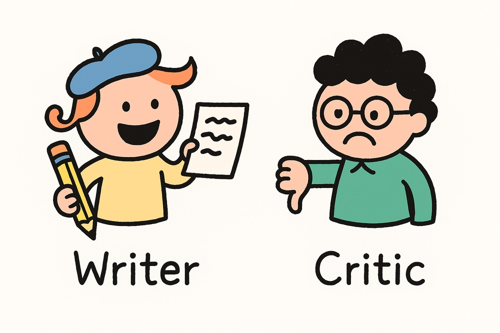
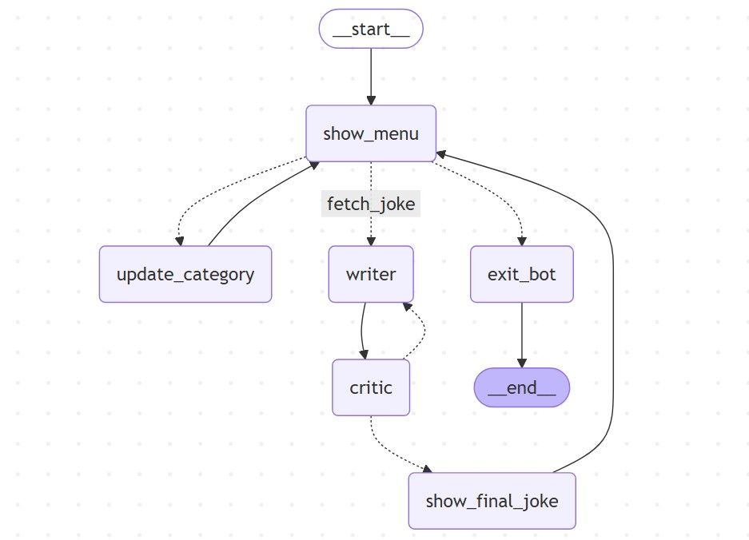

--DIVIDER--

---

[⬅️ Previous - First LangGraph Project](https://app.readytensor.ai/publications/T8WbWCjwJ4Mm)
[➡️ Next - Intro to LangSmith](https://app.readytensor.ai/publications/XOuxwqlmJmMG)

---

--DIVIDER--# TL;DR
In this lesson, you’ll upgrade your LangGraph bot with a Writer–Critic loop powered by an LLM. One node writes a joke, another evaluates it, and only approved jokes are shown to the user — giving you your first taste of dynamic, agentic behavior.

---

--DIVIDER--### 🎥 Watch the Demo
A joke-writing loop with Writer and Critic agents—revealing what LLMs get right (and wrong) about being funny.

:::youtube[Title]{#fduxs_HaPhM}

 <h3>💡 Want to build it yourself? </h3>
 
 You’ll find the full code in the linked repo—but we strongly encourage you to first complete the lesson and try implementing it on your own. The graph structure is simple, and you’ll learn a lot more by building than by copying.
 
 -----DIVIDER--:::info{title="Info"}
 <h2>🧱 This Lesson Builds on the Last One </h2>
 
 This lesson picks up where the [last one](https://app.readytensor.ai/publications/T8WbWCjwJ4Mm) left off — where we built a fun little joke bot using LangGraph and the `pyjokes` library. No LLMs, no agents — just clean graph logic, a stateful menu loop, and a few good laughs.
 
 If you haven’t already, check it out — then come back here to make your bot smarter, funnier, and a little more agentic.
 
 :::
 --DIVIDER--
 #  Goal 🎯
 
 In this lesson, you’ll upgrade the joke bot you built previously into an **agentic system** using LLMs.
 
 Specifically, you’ll create a **writer–critic loop**.
 --DIVIDER--
 --DIVIDER--
 In your system: 
 
 - The **writer** (an LLM) will generate developer-themed jokes.
 - The **critic** (another LLM call) will evaluate each joke and decide whether it’s good enough to show to the user.
 - If the joke is rejected, the writer tries again — up to a limit.
 - If it passes, the joke is displayed and added to the session history.
 
 You’ll implement this logic using **LangGraph**, building on the same menu structure, nodes, and routing patterns you already used.
 
 This is your first step into building systems that reason, reflect, and revise — not just respond.
 
 Let’s dive in.
 --DIVIDER--
 #  Updated Graph: Introducing a Writer–Critic Loop 🗺️
 
 Your new graph builds on the structure from the previous lesson — but this time, we’ve added two key agentic nodes: a **Writer** that generates a joke using an LLM, and a **Critic** that decides whether it’s good enough to show the user.
 
 Here’s how the flow works:--DIVIDER--
 
 
 > > 💡 If you haven’t already, take a quick look at the [previous lesson’s graph](https://app.readytensor.ai/publications/T8WbWCjwJ4Mm)
 > > It was a simple, no-LLM loop powered by pyjokes. Comparing the two will help you appreciate how LangGraph supports more dynamic, adaptive behavior with just a few structural tweaks.
 --DIVIDER--
 <h3>🔄 What’s New</h3>
 
 - The `fetch_joke` path now routes to the **Writer**, not directly to a joke function.
 - The **Writer** generates a joke and passes it to the **Critic**.
 - The **Critic** either:
 
   - Approves it, sending it to `show_final_joke`, or
   - Rejects it, looping back to the Writer to try again.
 
 - After a successful joke is shown, we loop back to the menu — just like before.
 
 This new graph introduces the idea of **internal feedback loops**, where agentic components assess and refine their own output before surfacing it to the user.
 
 Let’s break down how you’ll build this next.
 --DIVIDER--
 # 🧩 What You’ll Need to Do
 
 Here's what you'll need to implement to complete the writer–critic loop:
 
 * **Extend the state class** from the previous lesson to track things like the latest joke, approval status, and retry count.
 * **Create two new nodes**:
 
   * A **Writer** that uses an LLM to generate a joke based on the current category.
   * A **Critic** that evaluates the joke and decides if it’s good enough.
 * **Route the logic** so rejected jokes go back to the Writer, and only approved ones reach the user.
 * **Limit retries** to avoid infinite loops — think 5 tries max.
 * **Reset the evaluation state** after each successful joke (or when the user changes the category).
 * Use the **prompt builder** utility you built earlier to generate both Writer and Critic prompts from YAML config.
 
 This is your first real agentic loop — dynamic, self-evaluating, and designed to run until something “good enough” emerges.
 You’ll be surprised how much power you get by adding just two nodes.
 
 Ready to build? Go for it!
 --DIVIDER--:::info{title="Info"}
 A [reference implementation](https://github.com/readytensor/rt-agentic-ai-cert-week5) is available for this lesson, complete with working code.
 
 But don’t jump into the repo just yet.
 
 You’ll gain much more by following the instructions above and building the agentic loop yourself.
 
 Once you've got it working (or hit a wall), come back and compare it with the official version.
 
 :::--DIVIDER--
 #  Tips & Reminders💡
 
 * **Reuse your building blocks**: You already have a working LangGraph with menu routing, category switching, and state management — don’t start from scratch. Extend what you’ve built.
 
 * **Don’t overthink the Critic**: It doesn’t need to give feedback — it just needs to say “yes” or “no.” Keep it simple. A short prompt with clear evaluation criteria is enough.
 
 * **Limit retries**: Add a retry counter in your state. If the joke gets rejected too many times (say, 5), just show the latest attempt and move on. Don’t let the bot spiral into infinite rewriting.
 
 * **Modular prompts help**: Use your `prompt_builder` function with the YAML config. This keeps your Writer and Critic prompts clean, flexible, and easy to tweak.
 
 * **This isn’t about perfect jokes**: It’s about agentic behavior — generate, evaluate, revise. If your bot makes you groan instead of laugh, that’s still a win.
 
 ---
 
 --DIVIDER--:::info{title="Info"}
 
 <h2>⚠️ Why the Critic doesn’t give feedback</h2>
 
 Since jokes are short (1–2 lines), we don’t try to revise or improve them. If the Critic rejects a joke, we simply generate a new one. This makes the loop simpler — it’s just a pass/fail check, not a feedback-driven revision cycle.
 
 📌 In a future lesson, you’ll explore the **Reflection Agent** pattern, where the critic does provide feedback — enabling agents to revise, reflect, and improve over time.
 
 :::
 
 ---
 --DIVIDER--
 # 🧪 Stretch Goals (Optional)
 
 Ready to go beyond the basics? Here are some fun challenges that push your implementation a bit further:
 
 ## 🌀 Avoid Joke Repetition
 
 You may notice jokes occasionally repeat. That’s because the Writer (LLM) is stateless — it doesn’t remember past jokes.
 Try implementing a simple mechanism to **avoid repetition**:
 
 * Keep track of previously approved jokes
 * Compare newly generated jokes to that list
 * If a new joke is *too similar*, reject it and try again
 
 > ⚠️ Don’t rely on exact string matches — you’ll need **semantic similarity** (think embeddings or fuzzy matching).
 
 
 
 ## 🧍 Human-in-the-Loop Evaluation
 
 Instead of having the Critic decide, why not let a human vote?
 
 * Replace the Critic node with a **pause for user input**
 * Prompt the user to approve or reject each joke manually
 * Continue based on their response
 
 This is a great way to explore **human-in-the-loop supervision** — a powerful pattern in real-world agentic systems.
 
 
 
 ## 💾 Build a Joke Catalog
 
 Why let good jokes disappear?
 
 * Persist all approved jokes to disk (e.g. write to a JSON file or local DB)
 * Let your bot build up a growing catalog of jokes over time
 * Bonus: allow users to browse saved jokes in a future menu option
 
 This adds a light persistence layer to your system — another step toward real-world utility.
 
 ---
 --DIVIDER--
 #  You’ve Now Built ...
 
 In this lesson, you leveled up your LangGraph bot by adding a **writer–criticloop** — your first taste of agentic behavior powered by LLMs.
 
 You now know how to:
 
 * Use a **Writer** node to generate dynamic content from an LLM
 * Use a **Critic** node to decide whether that content is good enough
 * Route control flow based on internal evaluation
 * Build stateful, self-monitoring loops that only show the user what passes quality checks
 
 And you did all of it inside a clean, inspectable LangGraph structure — no tangled if-else logic, no giant monolithic prompt.
 
 You’ve just crossed the threshold into **agentic system design**: where outputs are generated, tested, and filtered internally before ever reaching the user.
 
 > Up next: you’ll explore **LangSmith** — the observability layer that lets you debug, trace, and improve flows like this with confidence.
 
 Let’s keep going.
 --DIVIDER--
 ---
 
 [⬅️ Previous - First LangGraph Project](https://app.readytensor.ai/publications/T8WbWCjwJ4Mm) 
 [➡️ Next - Intro to LangSmith](https://app.readytensor.ai/publications/XOuxwqlmJmMG) 
 
 ---
