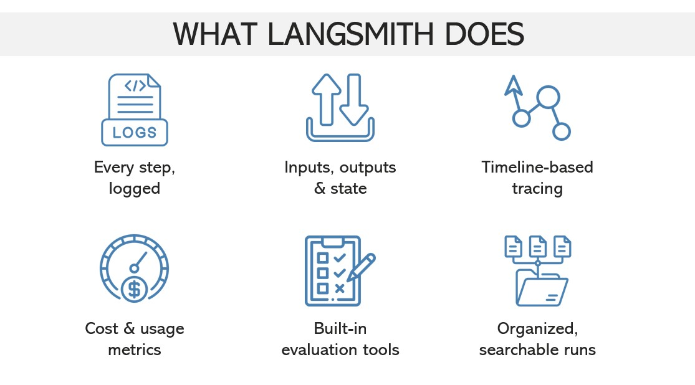
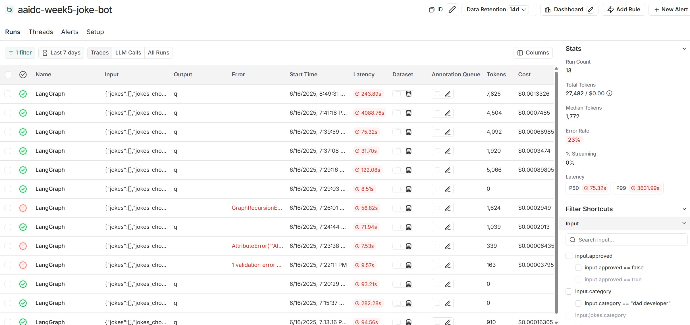
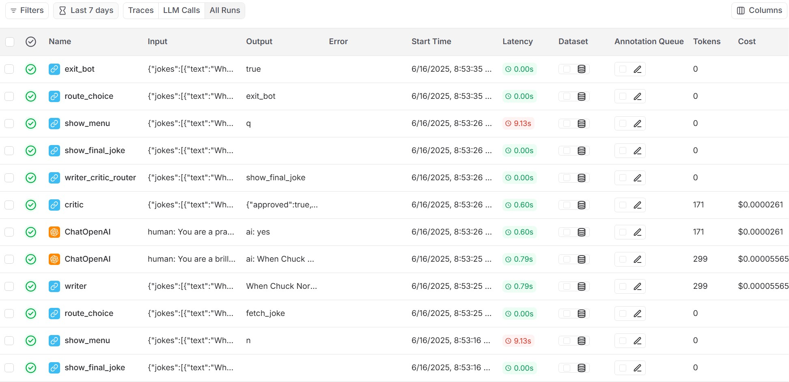
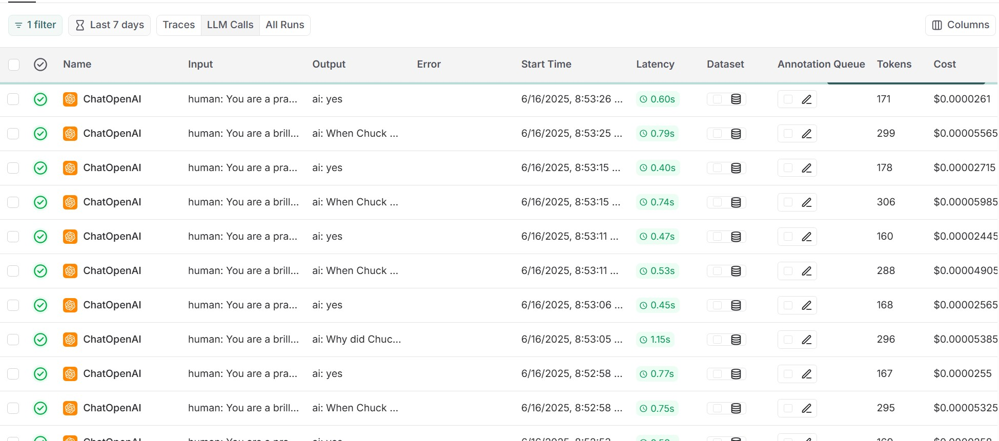

--DIVIDER--

---

[⬅️ Previous - LangGraph Writer-Critic Loop](https://app.readytensor.ai/publications/zvrcImvr8AF4)
[➡️ Next - Power of Tools](https://app.readytensor.ai/publications/hHwXrjkLnNaD)

---

--DIVIDER--

# TL;DR

LangSmith gives you full visibility into your agentic systems. It traces every node, logs every LLM and tool call, captures inputs and outputs, and shows exactly how your state evolved — all in a clean, visual UI.

It works seamlessly with LangGraph and LangChain, requires minimal setup, and becomes essential as your systems grow more complex.

--DIVIDER--

:::info{title="Additional Lesson Resources"}

 <h2> 💻 Code + 📹 Video Included</h2>
 This lesson includes a linked code repository and a mid-lesson video walkthrough of LangSmith in action. Perfect for hands-on builders and visual learners.
 
 :::
 
 ---

--DIVIDER--

# Why Logging and Observability Matter 🎣

Let’s say you built a chatbot to help customers track their orders. One day, a user asks:

> “Where’s my package?”

And your bot replies:

> “Dolphins are mammals that live in the ocean.” 🐬

Not great.

Now imagine you're trying to debug this. What went wrong?

- Was the user input misparsed?
- Did the prompt get mangled on its way to the LLM?
- Did the LLM hallucinate?
- Was there a bug in your routing logic?
- Did the wrong node run?
- Did a retry happen that you didn’t see?

If you’re flying blind — no logs, no state trace, no prompt capture — you’re left guessing.

> That’s not engineering. That’s gambling.

**LangSmith changes this.**
It logs every decision your system makes — from inputs to LLM prompts to tool calls to final output. It shows you the trace. It shows you the cost. It shows you what actually happened.

And starting now, it’s going to be part of every system you build.

---

--DIVIDER--

# What Is LangSmith? 🧠


--DIVIDER--

LangSmith is a platform that brings observability to language model–powered systems. It tracks everything your application does — from the moment a user sends input, to the final output, and every step in between.

At its core, LangSmith is a **tracing and evaluation layer** for LLM workflows. Whether you're using a simple chain or a complex multi-agent graph, it records:

- The inputs and outputs at every step
- Which tools or models were called
- How the system's state changed along the way
- How long things took, and what they cost

You can think of LangSmith as a **debugging lens** for your AI application. It doesn’t just tell you what your system _did_ — it shows you _how_ it got there, _why_ it chose that path, and _whether_ it met your expectations.

LangSmith integrates seamlessly with LangChain and LangGraph, but it also works with direct OpenAI calls and other LLM providers. Whether you’re building workflows, agents, or end-user apps, LangSmith gives you the transparency and control you need to iterate with confidence.

---

--DIVIDER--

# Core Features of LangSmith 🔧

LangSmith gives you full visibility into how your system behaves — from input to output, and everything in between.

--DIVIDER--



--DIVIDER--

LangSmith doesn’t just collect logs — it gives you the tools to understand your system’s behavior and improve it with confidence.

**Full-system traceability.** Every action your system takes — LLM calls, tool invocations, node transitions — is logged in sequence, so you can see how things actually ran.

**Live state visibility.** For each step, LangSmith shows you the exact input, output, and state updates — letting you debug without guesswork.

**Visual timeline.** Traces are displayed as interactive, navigable timelines. You can inspect branches, loops, retries, and conditional paths at a glance.

**Performance and cost insights.** LangSmith tracks token usage, latency, and per-call costs. No more wondering where the slowdowns or expenses are coming from.

**Automated evaluations.** With built-in LLM-powered grading, you can define test sets and measure output quality over time — no manual spot-checking required.

**Searchable, organized runs.** Tag, filter, and explore past runs by user, version, or use case — perfect for regression testing, debugging, or collaboration.

LangSmith turns observability into an asset, not just an afterthought.

---

--DIVIDER--

# 📹 Video Walkthrough: LangSmith in Action

:::youtube[Title]{#AqoqxkGy9NY}

In this walkthrough, we put LangSmith to work on the same agent you just built in previous lessons— and show how it helps you:

- Trace every step your agent takes: LLM calls, tool invocations, and graph transitions
- Visualize state changes, retries, and branching logic
- Spot errors fast with timeline-based replay
- Understand why something happened — not just that it did

If you're curious about debugging, monitoring, or evaluating your agentic systems at scale, this video will show you why LangSmith is the default choice.

---

--DIVIDER--

# LangSmith Setup: Tracing in Seconds ⚙️

LangSmith is designed to be frictionless. If you're using LangChain or LangGraph, **you don’t need to change a single line of code** — just set a few environment variables. If you're working outside those frameworks, setup is still just a few lines.

--DIVIDER--

## Option 1: Using LangChain or LangGraph

1.  **Install dependencies**

```bash
pip install -U langchain langchain-openai
```

2.  **Set environment variables**

```bash
export LANGSMITH_TRACING=true
export LANGSMITH_ENDPOINT="https://api.smith.langchain.com"
export LANGSMITH_API_KEY="<your-api-key>"
export LANGSMITH_PROJECT="your-project-name"
export OPENAI_API_KEY="<your-openai-api-key>"
```

3.  **Run your code — no changes required**

Any LLM, ChatModel, Chain, or LangGraph execution will automatically show up in LangSmith:

```python
from langchain_openai import ChatOpenAI

llm = ChatOpenAI()
llm.invoke("Hello, world!")
```

🎉 That’s it. You’re now logging full traces into LangSmith.

--DIVIDER--

## Option 2: Using Custom Code (no LangChain)

If you’re working directly with OpenAI (or other LLMs), you can still get full tracing with just two imports and one decorator.

1.  **Install LangSmith**

```bash
pip install -U langsmith

```

2.  **Set environment variables**

```bash
export LANGSMITH_TRACING=true
export LANGSMITH_ENDPOINT="https://api.smith.langchain.com"
export LANGSMITH_API_KEY="<your-api-key>"
export LANGSMITH_PROJECT="your-project-name"
export OPENAI_API_KEY="<your-openai-api-key>"

```

2.  **Wrap your OpenAI client and trace your function**

```python
import openai
from langsmith.wrappers import wrap_openai
from langsmith import traceable

# Auto-trace OpenAI calls
client = wrap_openai(openai.Client())

@traceable  # Auto-trace this function
def pipeline(user_input: str):
    result = client.chat.completions.create(
        messages=[{"role": "user", "content": user_input}],
        model="gpt-3.5-turbo"
    )
    return result.choices[0].message.content

pipeline("Hello, world!")
```

From this point on, LangSmith will be enabled by default in the program — so every graph, agent, or LLM call you build will be fully traceable, inspectable, and ready for debugging.

--DIVIDER--

:::info{title="Info"}
💡 Note: We’re using OpenAI here for illustration, but LangSmith supports tracing with any LLM provider. If your client supports standard HTTP-based API calls, you can wrap and trace it the same way.
:::

---

--DIVIDER--

# What LangSmith Tracks: Traces, runs, and calls

Once tracing is enabled, LangSmith captures everything your system does — not just the final output, but the full path it took to get there. To make this easy to navigate, LangSmith breaks the activity into three key layers of observability:

--DIVIDER--

At the top level, a **trace** represents a full interaction — typically one user input or system operation. This might be a single LLM call, or a multi-step graph execution. The following is a view of a trace from LangSmith:



--DIVIDER--

Inside a trace, each **run** represents one step in the process — like calling a tool, executing a node in LangGraph, invoking an LLM, or running a chain. A run is where decision points and state transitions happen. Here we see a runs dashboard:



--DIVIDER--

Within each run, LangSmith also logs **calls** — the actual LLM or API calls that were made. You’ll see exactly what was sent, what came back, how long it took, and how many tokens it used. Here we can visualize individual calls and their metrics:



--DIVIDER--

This layered view gives you both high-level insight and step-by-step details:

- Want to see the entire conversation flow? Look at the **trace**.
- Want to debug a specific decision point? Zoom in on the **run**.
- Want to check the prompt and response? Inspect the **call**.

LangSmith automatically stitches this all together — so you can reconstruct what happened, understand why, and improve what comes next.

---

--DIVIDER--

# Evaluation Mode: Let the LLM Grade Itself 🧪

Once you can trace what your system is doing, the next question is:
**Is it doing it well?**

That’s where LangSmith’s **Evaluation Mode** comes in.

With Evaluation Mode, you can define test cases — a prompt and an expected behavior — and let LangSmith automatically score your system’s responses using an LLM. This makes it easy to assess quality at scale, catch regressions, and compare versions.

You can evaluate for:

- **Correctness** – Did the model respond accurately?
- **Relevance** – Was the answer on-topic and useful?
- **Factuality** – Did it invent anything?
- **Style or tone** – Was it polite, concise, branded, etc.?

You can even use your own evaluation prompts and grading criteria. Behind the scenes, LangSmith uses the same models you already work with to judge your outputs — so evaluation stays aligned with the capabilities of your system.

> You’re not just building a system that _works_ — you’re building one you can _trust_.
> Evaluation Mode gives you a way to measure that, every step of the way.

---

--DIVIDER--

:::info{title="Info"}

 <h2>🤔 Sidebar: Do You Have to Use LangSmith? </h2> 
 
 Not necessarily.
 
 Most LLM provider SDKs already give you the basics:
 You’ll see prompts, responses, token usage, and maybe some latency stats or error traces.
 
 If your system is just a few isolated API calls — that might be enough.
 
 But once you’re working with **agentic workflows**, things get more complex.
 You’ll need to track state changes, conditional routing, retries, loops, tool calls, and multi-step flows. That’s when things get messy.
 
 Without LangSmith, you’d be looking at:
 
 * Writing your own logging infrastructure
 * Manually tracking state across steps
 * Piecing together logs from different tools or libraries
 * Guessing how your system arrived at a particular output
 
 It’s not impossible — but it’s brittle, time-consuming, and hard to scale.
 
 LangSmith handles all of that for you.
 It gives you structured, end-to-end traces, a visual timeline of every run, searchable metadata, cost tracking, and LLM-based evaluation tools — all integrated cleanly with LangChain and LangGraph.
 
 So no, you don’t *have* to use LangSmith.
 But once your system gets interesting, it’s hard to imagine not using it.
 
 :::
 
 ---

--DIVIDER--

# Wrapping Up: Observability On by Default

You’ve now seen what LangSmith brings to the table - full visibility into how your agentic system behaves, step by step, with zero guesswork.

From here on out, **LangSmith will be enabled by default** in all your projects.
Every LLM call, tool invocation, node transition, and state update - fully traceable.

You’re not just building AI systems.
You’re building **inspectable**, **debuggable**, **production-ready** ones.

---

--DIVIDER--

# 📚 **Want to Go Deeper?**

[LangSmith Docs](https://docs.smith.langchain.com/)

--DIVIDER--

---

[⬅️ Previous - LangGraph Writer-Critic Loop](https://app.readytensor.ai/publications/zvrcImvr8AF4)
[➡️ Next - Power of Tools](https://app.readytensor.ai/publications/hHwXrjkLnNaD)

---
