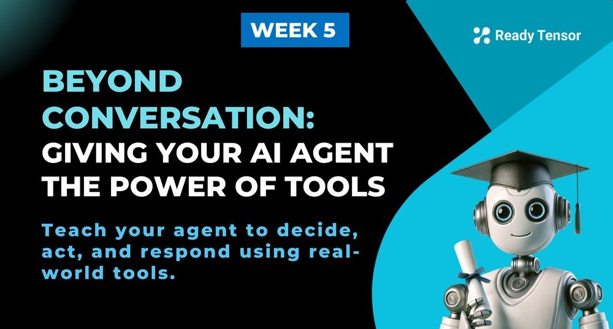
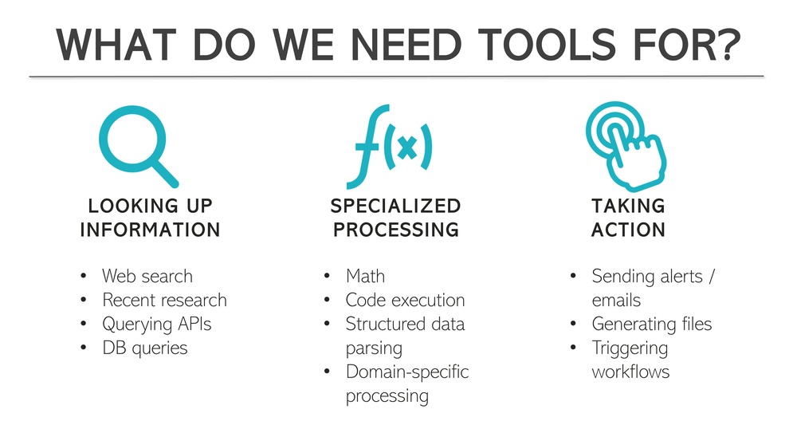
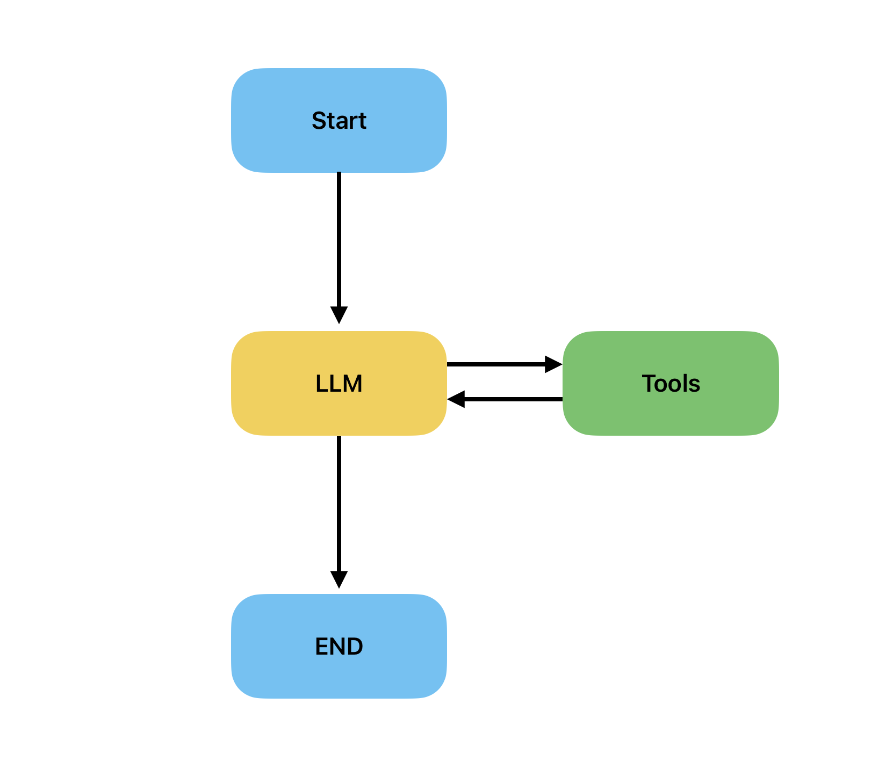

--DIVIDER--

---

[⬅️ Previous - Intro to LangSmith](https://app.readytensor.ai/publications/XOuxwqlmJmMG)
[➡️ Next - Creating Custom Tools](https://app.readytensor.ai/publications/custom-tools-custom-powers-extending-your-agents-capabilities-pcFgUEFJjkzC)

---

--DIVIDER--

# TLDR

In this lesson, you’ll take your AI agent beyond passive conversation and give it the power to take real action using tools. You’ll integrate a built-in search tool into a LangGraph workflow and design a Think–Act–Think loop where the agent decides when to use the tool and how to respond. By the end, your agent won’t just talk about the world — it will interact with it.

---

--DIVIDER--

# From Smart Talker to Real-World Actor

So you know how to build a chatbot.

You’ve added smart prompting.
You’ve taught it to reason step by step.
You’ve connected it to documents using RAG, so it can surface relevant answers on demand.

It can retrieve. It can explain. It can summarize.

But is that enough?

 <p align="center"><strong>🤔 What’s something your assistant still can’t <em>do</em> — even though users might expect it to?</strong></p>
 
 Can it:
 
 * Look up the **latest papers** in the research literature?
 * Pull data from a **connected database**?
 * **Send a notification** based on an insight?
 * **Generate a downloadable PDF** from its response?
 
 If not, your agent may still feel clever — but ultimately passive.
 
 And that points to a deeper limitation.
 
 Language models can simulate intelligent thinking — but they can’t interact with the world around them.
 They can’t perform a live search, fetch new data, trigger a workflow, or take meaningful action beyond generating text.
 
 They can plan, but not execute. Observe, but not affect.
 
 > Even the smartest human can’t do much without tools.
 > Locked in a library, you can read and explain — but you can’t act.
 
 If you want your agent to behave like a real-world problem solver — not just a good explainer — it needs the ability to *do* things.
 
 > It needs tools.
 
 ---

--DIVIDER--

# 🧰 What Are Tools in Agentic Systems?

Let’s make this simple:

> **Tools are how your agent gets things done.**

They’re the functions, services, or interfaces your agent can call to interact with the world beyond language — whether that means pulling live data, running calculations, sending messages, or transforming output.

At a technical level, a tool is **just a callable function** — but with a few important properties:

- It has a **clear purpose** (e.g. “Search the web” or “Summarize a PDF”)
- It accepts **structured input** (parameters)
- It returns **structured output** the agent can interpret
- It’s **declaratively registered** with the agent (so the agent knows what’s available)

In LangChain, tools follow a standardized interface. You register them with the agent like this:

> “Here’s a capability you can use — and how to use it.”

Once a tool is registered, the agent can decide if and when to call it, based on user input and its own reasoning.

---

--DIVIDER--

# 🧭 What Do We Need Tools For?

Now that you know what a tool is, let’s talk about **why you’d reach for one**.

You don’t add tools just to show off — you add them to help your agent do something it couldn’t otherwise do well (or at all). Here are the core categories where tools are essential:



---

--DIVIDER--

## Looking Up Information the Model Doesn’t Know 🔍

LLMs are trained on static data — they don’t know what happened yesterday or even five minutes ago.

If your agent needs to:

- Search the web
- Fetch recent papers or articles
- Query a database or API for current values

…it needs a tool to access that information in real time.

> **Example**: A search tool like `TavilySearchResults` enables your agent to pull fresh information instead of relying on outdated training data.

---

## Specialized Processing ➗

Some tasks are just outside the LLM’s core capabilities:

- Performing precise calculations
- Executing code
- Parsing structured files like CSV or PDF
- Interacting with specialized domains (e.g. geospatial, time series, chemical data)

Even if an LLM can describe how to do something, that’s not the same as actually doing it.

> **Example**: A calculator tool can evaluate a complex formula and return the correct answer — something LLMs often fumble.

---

## Taking Action in the Real World 📤

LLMs can suggest actions — but they can’t take them unless you give them the wiring.

Tools let your agent:

- Send an email or alert
- Post to a Slack channel
- Trigger a workflow or job
- Generate and save a file (like a downloadable PDF)

These are operations that reach beyond the conversation — they make things happen.

> **Example**: You can use agentic systems to send notifications or emails to users triggered by specific logic in the decision-process.

---

These categories aren’t exhaustive, but they cover the most common reasons to introduce tools into your system. If your agent is hitting a wall — it can’t fetch, calculate, or execute something — that’s usually a sign it needs a tool.

---

--DIVIDER--

# Tool Use vs. Tool Choice 🛠️

There’s a critical distinction in building agentic behavior:

- **Tool Use** is the _mechanics_ — how to invoke the tool and pass the right inputs.
- **Tool Choice** is the _judgment_ — when a tool is actually needed, and which one to use.

A well-structured agent doesn’t just have tools.
It knows when to use them.

In LangChain, this distinction is reflected in how you bind tools to your agent:
the language model itself decides whether to call a tool based on the user’s input and its own internal reasoning.

> Just like a smart teammate, it won’t reach for the hammer unless there’s a nail.

---

--DIVIDER--

# Integrating Tools into a LangGraph Agent

Now that you understand what tools are and why they matter, let’s see how to actually wire one into an agent workflow.

We’ll use **Tavily**, a web search tool, to help the agent look up current information. You’ll build a LangGraph where the agent decides when to use the tool and how to respond once it has the results.

--DIVIDER--

## What We’re About to Build

At a high level, this graph has three key components:

1.  **LLM Node**: Handles reasoning and decides whether to call a tool.
2.  **Tools Node**: Executes the tool if needed.
3.  **Router Logic**: Chooses whether to stop or loop back to the LLM with updated context.

The flow looks like this:



The agent thinks → acts if needed → then thinks again.

---

--DIVIDER--

## Building It Step by Step 🧱

We’ll build this agent step by step:

1.  **Tool Setup** — Load the Tavily search tool and prepare the LLM.
2.  **Agent State Definition** — Create a `State` object to track messages.
3.  **Tool Registration** — Register available tools so the LLM knows what it can use.
4.  **LLM Node** — Let the agent decide whether to respond or call a tool.
5.  **Tools Node** — Execute the tool and return results back to the agent.
6.  **Routing Logic** — Determine whether to use a tool or respond directly.
7.  **Graph Assembly** — Connect all the pieces into a working LangGraph.

Let’s get started.

---

--DIVIDER--

### Step 1: Essential Imports and Setup

Begin by gathering the necessary components, akin to assembling a toolkit:

```python
from typing import Annotated
from typing_extensions import TypedDict
from langgraph.graph import StateGraph, END
from langgraph.graph.message import add_messages
from langchain_core.messages import HumanMessage, SystemMessage, ToolMessage
from langchain_community.tools.tavily_search import TavilySearchResults
from langchain_openai import ChatOpenAI

from dotenv import load_dotenv
load_dotenv()

# Set up your LLM - the brain of your agent
llm = ChatOpenAI(model="gpt-4o-mini", temperature=0)
```

_This sets up the graph framework, message types, the search tool, and our LLM. The `temperature=0` ensures consistent responses._

--DIVIDER--

### Step 2: Define the Agent's Memory and Tools

Create the structure for your agent's memory and give it access to tools:

```python
# Define your agent's state - this is your agent's memory
class State(TypedDict):
    messages: Annotated[list, add_messages]

# Create your tools - your agent's capabilities
def get_tools():
    return [
        TavilySearchResults(max_results=3, search_depth="advanced")
    ]
```

_The `State` class defines what your agent remembers, and `get_tools()` returns the tools your agent can use. Currently, it's just Tavily search, but you can add more tools._

--DIVIDER--

### Step 3: The Thinking Node

This is where your agent's brain decides whether to use tools or respond directly:

```python
# The LLM node - where your agent thinks and decides
def llm_node(state: State):
    """Your agent's brain - decides whether to use tools or respond."""
    tools = get_tools()
    llm_with_tools = llm.bind_tools(tools)  # Give your agent access to tools

    response = llm_with_tools.invoke(state["messages"])
    return {"messages": [response]}
```

_`bind_tools()` informs the LLM about available tools, allowing it to decide whether to call a tool or respond directly._

--DIVIDER--

### Step 4: The Action Node

When your agent decides to use tools, this is where the work gets done:

```python
# The tools node - where your agent takes action
def tools_node(state: State):
    """Your agent's hands - executes the chosen tools."""
    tools = get_tools()
    tool_registry = {tool.name: tool for tool in tools}

    last_message = state["messages"][-1]
    tool_messages = []

    # Execute each tool the agent requested
    for tool_call in last_message.tool_calls:
        tool = tool_registry[tool_call["name"]]
        result = tool.invoke(tool_call["args"])

        # Send the result back to the agent
        tool_messages.append(ToolMessage(
            content=str(result),
            tool_call_id=tool_call["id"]
        ))

    return {"messages": tool_messages}
```

_This node executes the tools your agent requested, creating a registry of available tools, executing each tool call, and packaging the results into messages._

--DIVIDER--

### Step 5: The Decision Logic

This function determines the flow — should we continue to tools or are we done?

```python
# Decision function - should we use tools or finish?
def should_continue(state: State):
    """Decides whether to use tools or provide final answer."""
    last_message = state["messages"][-1]

    if hasattr(last_message, "tool_calls") and last_message.tool_calls:
        return "tools"  # Agent wants to use tools
    return END  # Agent is ready to respond
```

_This is the traffic controller of your workflow. If the last message contains tool calls, we route to the tools node. Otherwise, we're done and return the final answer._

--DIVIDER--

### Step 6: Building the Complete Workflow

Assemble all the pieces into a working agent:

```python
# Build the complete workflow
def create_agent():
    graph = StateGraph(State)

    # Add the nodes
    graph.add_node("llm", llm_node)
    graph.add_node("tools", tools_node)

    # Set the starting point
    graph.set_entry_point("llm")

    # Add the flow logic
    graph.add_conditional_edges("llm", should_continue, {"tools": "tools", END: END})
    graph.add_edge("tools", "llm")  # After using tools, go back to thinking

    return graph.compile()
```

_This creates the workflow graph. We start with the LLM node, which can either end or go to tools. After using tools, we return to the LLM to process results._

--DIVIDER--

### Step 7: Testing Your Enhanced Agent

See your tool-enabled agent in action:

```python
# Create and use your enhanced agent
agent = create_agent()

# Test it out!
initial_state = {
    "messages": [
        SystemMessage(content="You are a helpful assistant with access to web search. Use the search tool when you need current information."),
        HumanMessage(content="What's the latest news about AI developments in 2025?")
    ]
}

result = agent.invoke(initial_state)
print(result["messages"][-1].content)
```

_This creates your agent and tests it with a question requiring current information. The system message informs the agent about its search capability, and the human message asks for recent news — perfect for demonstrating tool usage!_

--DIVIDER--

# Wrapping Up: From Talker to Doer 🏁

You just gave your agent the power to act.

With a single tool — and a simple loop — it can now search the web, decide when fresh information is needed, and respond with real-world context.

You’ve already seen how agents can reason, reflect, and even collaborate.
Now, you’ve added something essential: the ability to interact with the world beyond language.

🧠 Think → 🔧 Act → 🧠 Think again
That’s the core loop you’ve now implemented.

This is a key step toward truly agentic systems — ones that don’t just _think_, but _do_.

> So far, you’ve plugged in tools that already exist.
> Next, you’ll learn how to build your own — and give your agent exactly the capabilities it needs.

--DIVIDER--

---

[⬅️ Previous - Intro to LangSmith](https://app.readytensor.ai/publications/XOuxwqlmJmMG)
[➡️ Next - Creating Custom Tools](https://app.readytensor.ai/publications/custom-tools-custom-powers-extending-your-agents-capabilities-pcFgUEFJjkzC)

---
