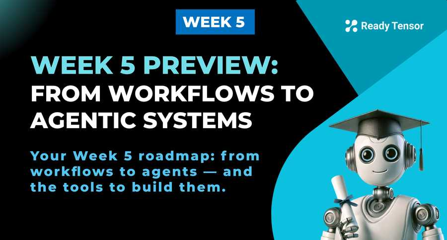

--DIVIDER--

---

[⬅️ Previous - Module 2 Project Requirements](https://app.readytensor.ai/publications/gUPu2RlgjzNy)
[➡️ Next - From LLM Workflows to Agents](https://app.readytensor.ai/publications/Nu7EEaBmrP5C)

---

--DIVIDER--

**Welcome to Module 2 of the Agentic AI Developer Certification Program! 🚀**

Whether you wrapped up Module 1 with a completed project or you're continuing your learning at your own pace — we’re excited to have you here as we kick off the next phase of your journey.

In Module 1, we laid the foundations: you explored how LLMs can be used to build smart assistants, designed multi-step workflows, and implemented powerful retrieval pipelines. Along the way, you picked up prompting techniques, memory management strategies, and system design patterns that turn static chatbots into dynamic assistants.

**Now it’s time to level up.**

**Module 2** is where we shift from building assistants to building **agents** — systems that can reason, use tools, and operate more autonomously. We’ll introduce you to **LangGraph**, dive into **multi-agent architectures**, and show you how to scale your systems with **tools, observability, and design patterns** that are built for real-world complexity.

You’re not just using LLMs anymore — you’re **engineering intelligence**.

Let’s begin.

--DIVIDER--

:::info{title="Info"}

 <h2> About Your Module 2 Project </h2>
 
 Before we dive into this week’s lessons, we’re also introducing the [**Module 2 Project**](https://app.readytensor.ai/publications/gUPu2RlgjzNy) — your capstone for the next four weeks. This project will challenge you to apply everything you learn in Module 2 to build and document a real, agentic system. You'll find a separate publication outlining the requirements, expectations, and submission details.
:::

--DIVIDER--

# 📝 What’s in store this week?

Here’s how the lessons for **Week 5** are structured:
**Lesson 1**: Learn when to graduate from workflows to agents
**Lesson 2a**: Dive into LangGraph — what it is, how it works, and why it matters
**Lesson 2b**: Build your first graph system using LangGraph (no-LLM)
**Lesson 2c**: Build an Agentic system using LangGraph
**Lesson 3**: Add observability with LangSmith
**Lesson 4a**: Use built-in tools and toolkits in LangChain
**Lesson 4b**: Build and register your own custom tools

--DIVIDER--

# 🚀 What will you be able to build?

By the end of this week, you'll have the skills to **move beyond linear task flows** and start building **truly agentic systems**. You’ll understand the building blocks of agent graphs, tool integration, and debugging workflows — all with real-world code.

Onward!

--DIVIDER--

---

[⬅️ Previous - Module 2 Project Requirements](https://app.readytensor.ai/publications/gUPu2RlgjzNy)
[➡️ Next - From LLM Workflows to Agents](https://app.readytensor.ai/publications/Nu7EEaBmrP5C)

---
